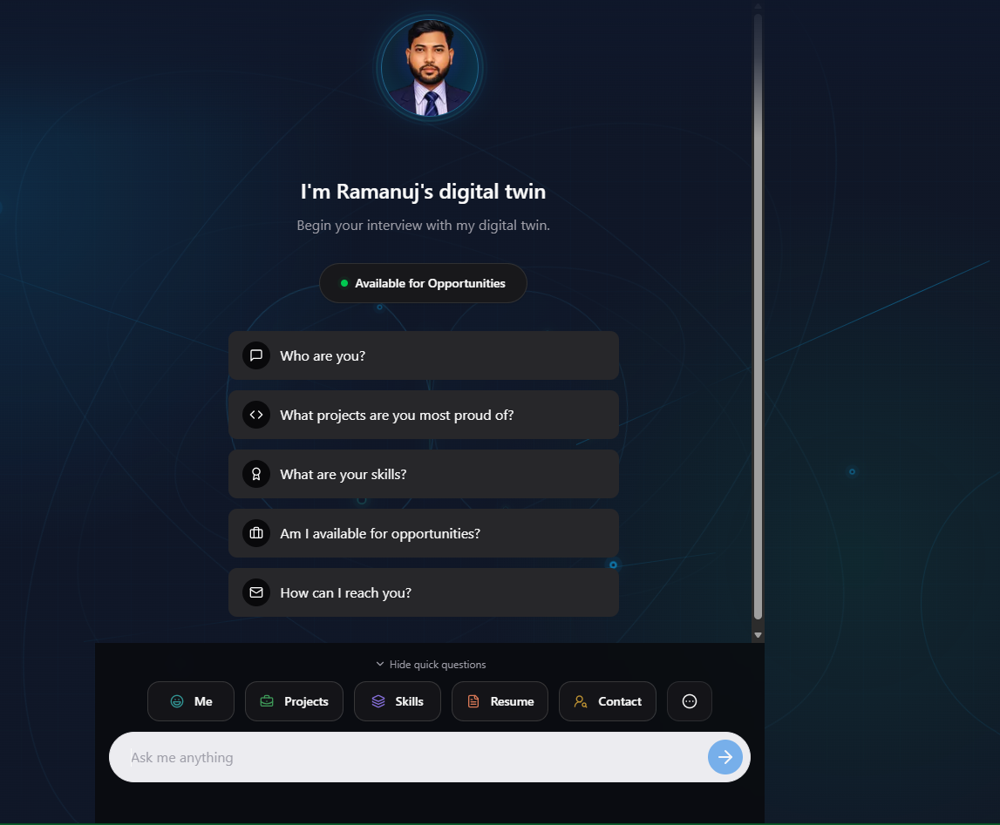

# Ramanuj Saket Portfolio

An interactive portfolio for Ramanuj Saket, an AI/ML/Gen-AI Engineer. The site presents professional experience, projects, skills, education, availability, and an AI-powered digital twin chat experience.

<p>
	<a href="https://ramaaiportfolio.vercel.app/">🚀 View Live Portfolio Demo</a>
</p>

## Landing Page



## Contact and Demo

<a href="mailto:rmnjsaket4664@gmail.com"></a>
<a href="https://www.linkedin.com/in/ramanuj-saket/"></a>
<a href="https://www.kaggle.com/ramanujsaket"></a>
<a href="https://github.com/LearnCodeWithRam"></a>
<a href="https://ramaaiportfolio.vercel.app/"></a>

<a href="portfolio-config.json"></a>
<a href="#chat-api"></a>


## Features

- Responsive portfolio interface built with Next.js and React.
- Profile, experience, skills, projects, resume, and availability sections.
- JSON-driven portfolio content in `portfolio-config.json`.
- AI chat with portfolio-specific tools for projects, skills, resume, contact, and availability.
- Cloudflare Workers AI as an optional primary provider, followed by Gemini, Mistral, and Groq.
- Light and dark theme support.

## Tech Stack

- Next.js 15
- React 19
- TypeScript
- Tailwind CSS
- Vercel AI SDK
- Gemini, Mistral, and Groq providers with ordered fallback
- Framer Motion

## Getting Started

### Requirements

- Node.js 20 or newer
- An API key for Gemini, Mistral, and/or Groq for AI chat

### Install

```bash
npm install
```

### Configure environment variables

Create `.env.local` in the project root:

```env
# Optional Cloudflare Workers AI primary provider
CLOUDFLARE_ACCOUNT_ID=your_cloudflare_account_id
CLOUDFLARE_API_TOKEN=your_cloudflare_api_token
CLOUDFLARE_MODEL=@cf/google/gemma-4-26b-a4b-it

# Fallback providers
GEMINI_API_KEY=your_gemini_api_key
MISTRAL_API_KEY=your_mistral_api_key
GROQ_API_KEY=your_groq_api_key

# Optional model overrides
GEMINI_MODEL=gemini-3.6-flash
MISTRAL_MODEL=mistral-small-latest
GROQ_MODEL=openai/gpt-oss-20b
```

When Cloudflare credentials are configured, Cloudflare Workers AI is tried first, followed by Gemini, Mistral, and Groq. Without Cloudflare credentials, Gemini is tried first. The next configured provider is used when the previous provider returns an authentication, model-not-found, rate-limit, timeout, network, overload, or server error. `GOOGLE_GENERATIVE_AI_API_KEY` can also be used instead of `GEMINI_API_KEY`.

### Run locally

```bash
npm run dev
```

Open [http://localhost:3000](http://localhost:3000).

## Updating Portfolio Content

Edit `portfolio-config.json` to update the portfolio data. The active configuration includes:

- Personal details and profile image
- Education and achievements
- Professional experience
- Skills and technical domains
- Featured projects and metrics
- Social links and contact details
- Resume information
- Availability and career preferences

Profile assets are stored in `public/`. The current profile image is `public/profile.png`, with `public/placeholder.jpg` as the fallback.

## Project Structure

```text
portfolio-main/
├── portfolio-config.json       # Portfolio content
├── public/                     # Images and static assets
├── src/
│   ├── app/                    # Next.js routes and chat API
│   ├── components/             # Portfolio and chat UI
│   ├── lib/                    # Config loading and parsing
│   ├── types/                  # TypeScript types
│   └── hooks/                  # React hooks
├── package.json
└── README.md
```

## Chat API

The chat endpoint is available at `/api/chat`. It uses the portfolio configuration as the system prompt and exposes tools for:

- Presenting Ramanuj's background
- Listing projects and skills
- Providing resume and contact information
- Explaining availability and career interests

Provider failures are logged with safe diagnostics, while users receive a generic service-availability message instead of provider credentials or raw errors.

## Validation and Build

Validate the JSON configuration:

```bash
node -e "JSON.parse(require('fs').readFileSync('portfolio-config.json')); console.log('Valid JSON')"
```

Create a production build:

```bash
npm run build
```

Start the production server:

```bash
npm run start
```

## Deployment

The app can be deployed to Vercel or another Node.js hosting platform. Configure the provider credentials you intend to use in the deployment environment before starting the application.

## License

See [docs/LICENSE](docs/LICENSE).
